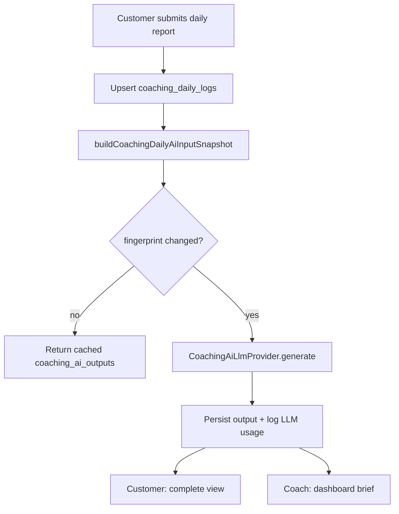

# AI Coaching Phase 2 — Memory Architecture & AI Cost Telemetry (Audit / Plan)

**Status:** Planning only — no OpenAI integration, no AI responses in this document.

**Date:** 2026-08-11

---

## 1. Executive summary

Phase 1 coaching already stores rich **activity memory** (daily logs, meal photos, plan snapshot, body records). Phase 2 AI needs a **second layer**: persisted AI outputs, reproducible input snapshots, intervention history, and **quantitative cost telemetry**.

This audit compares what exists today, what patterns to reuse from Consultation AI and AI Radar, and proposes a minimal schema + service design **before** any provider wiring.

---

## 2. Current state (Phase 1)

### 2.1 Activity data — source of truth for AI context

| Source | Storage | AI-ready? |
|--------|---------|-----------|
| Daily logs | `coaching_daily_logs` (027 + 028) | Yes — water, exercise, bowel, sleep times + computed duration, customer note, `submitted_at` |
| Meals | `coaching_meal_entries` + `coaching_meal_photos` | Partial — text + private photo paths; **no vision analysis** |
| Plan | `coaching_enrollments.plan_snapshot_json` | Yes — frozen coach instructions |
| Goal / baseline | `coaching_enrollments.goal`, `baseline_body_record_id` | Yes |
| Body trends | `body_composition_records` (reuse) | Yes — loaded in coach detail API |
| Progress photos | `customer_progress_photos` (reuse, base64) | Read-only; future visual context |
| Adherence | Computed via `coaching-completion.ts` | Yes — objective flags, not stored |

**Service helpers already useful for memory assembly:**

- `listCoachingDailyLogsForEnrollment()` — recent logs (default 30 days)
- `getCoachingDailyLogDetail()` — single day + meals + signed photo URLs
- `buildCoachingTodayStatus()` — dashboard summary

### 2.2 Documented AI context requirements

From `docs/COACHING.md` (Phase 2+):

1. Today's meals  
2. Recent multi-day eating patterns  
3. Water, sleep, exercise, bowel movement  
4. Customer notes  
5. Recent body measurements  
6. Visual body changes (future)  
7. Goal and plan snapshot  
8. Historical adherence  

**Gap:** No code builds a unified **input snapshot** JSON for LLM calls.

### 2.3 What does NOT exist for coaching AI

- No `src/lib/coaching/ai/` module
- No `coaching_ai_*` tables
- No persisted daily coach response (UI placeholder only: `CoachingDailyCompleteView`)
- No meal photo vision pipeline
- No link to Consultation Engine (intentionally separate)

---

## 3. Reference patterns in codebase

### 3.1 Consultation AI (`026_consultation_ai_outputs.sql`) — **primary template**

| Aspect | Pattern |
|--------|---------|
| Persistence | `consultation_ai_outputs`: `(session_id, point_key)` unique |
| Input | `input_snapshot jsonb` — sanitized, reproducible |
| Output | `output_json jsonb` — structured schema |
| Metadata | `model`, `status`, `error_message`, `regeneration_count` |
| Service | `build-input-snapshot.ts` → provider → upsert |
| API | GET/POST per `pointKey` |

**Strengths for coaching:** simple upsert, owner RLS, regeneration cap, failed state.

**Weaknesses for cost:** `promptVersion` and `rawJson` returned by provider but **not persisted**; no token/cost fields.

### 3.2 AI Radar (`candidate_analysis_runs`) — fingerprint + append

| Aspect | Pattern |
|--------|---------|
| Persistence | Append analysis runs with fingerprint cache |
| Dedup | Skip LLM if input fingerprint unchanged |
| Metadata | `model_id`, `prompt_version`, extraction JSON |

**Strengths for coaching:** avoid re-running daily feedback when log unchanged; audit trail.

**Weaknesses:** heavier schema; still **no token/cost** despite `AI_RADAR.md` §11.3–11.4 spec.

### 3.3 Quiz AI followups (`021`) — not a model

Rule-based messages with `model = 'rule_v1'`. Not applicable except as minimal “output + model label” precedent.

---

## 4. Proposed Coaching Memory Architecture (Phase 2a)

### 4.1 Design principles

1. **Activity memory stays in Phase 1 tables** — AI never replaces source of truth.
2. **AI memory is additive** — snapshots + outputs + optional rolling summaries.
3. **Reproducibility** — every AI call stores `input_snapshot` + `prompt_version` + `model`.
4. **Coach boundary** — customer portal sees customer-safe outputs only; coach sees full detail.
5. **No blame architecture** — store intervention level, not “risk scores” (per product rules).

### 4.2 Proposed tables (migration `029_coaching_ai_v1.sql` — not created yet)

#### `coaching_ai_outputs`

Mirrors consultation pattern, scoped to enrollment + log date + point key.

```sql
-- Conceptual — implement in future migration
coaching_ai_outputs (
  id uuid PK,
  enrollment_id uuid FK → coaching_enrollments,
  customer_id uuid FK,
  owner_member_id uuid FK,
  log_date date NULL,              -- NULL for enrollment-level insights
  point_key text NOT NULL,         -- see §4.3
  input_snapshot jsonb NOT NULL,
  output_json jsonb,
  input_fingerprint text,          -- sha256 of canonical snapshot (Radar pattern)
  model text,
  prompt_version text NOT NULL,
  status text NOT NULL,            -- pending | completed | failed
  error_message text,
  regeneration_count int DEFAULT 0,
  created_at, updated_at,
  UNIQUE (enrollment_id, log_date, point_key)  -- log_date coalesce for nulls via partial index
)
```

**RLS:** owner_member_id = authenticated coach (same as coaching_enrollments).

**Portal read:** service-role API returns customer-safe subset only (no coach notes, no internal reasoning).

#### `coaching_ai_summaries` (optional Phase 2b)

Rolling memory for multi-day context without sending 30 days raw logs every call.

```sql
coaching_ai_summaries (
  enrollment_id uuid,
  summary_type text,               -- weekly_adherence | eating_pattern | intervention_log
  window_start date,
  window_end date,
  summary_json jsonb,
  source_log_count int,
  model text,
  prompt_version text,
  created_at
)
```

Generated asynchronously (cron or on weekly body check-in), not on every daily submit.

### 4.3 Proposed `point_key` values (V1 AI scope)

| point_key | Trigger | Consumer |
|-----------|---------|----------|
| `daily_coach_response` | Customer submits daily report | Customer portal complete view |
| `daily_coach_brief` | Same trigger | Coach dashboard (1-line, no ranking) |
| `meal_photo_note` | Optional per meal photo upload | Internal context only (future) |

**Explicitly out of V1 AI scope:** risk score, ranking, automatic plan changes, medical diagnosis.

### 4.4 Input snapshot builder (new module)

**File (future):** `src/lib/coaching/ai/build-input-snapshot.ts`

Proposed snapshot shape:

```typescript
type CoachingDailyAiInputSnapshot = {
  version: 1;
  logDate: string;
  enrollment: { goal: string | null; startedAt: string; daysSinceStart: number };
  planSnapshot: CoachingPlanSnapshot;
  today: {
    meals: Array<{ slot: string; textNote: string | null; hasPhoto: boolean }>;
    waterMl: number | null;
    sleep: { bedtime: string | null; wakeTime: string | null; duration: string | null };
    exerciseNote: string | null;
    bowelMovementCount: number | null;
    customerNote: string | null;
    submittedAt: string | null;
  };
  recentDays: Array<{
    logDate: string;
    primaryMealsDone: number;
    waterMl: number | null;
    sleepDuration: string | null;
    exerciseDone: boolean;
    submitted: boolean;
  }>; // last 7–14 days, computed not stored
  bodyTrend?: { latest: BodySummary; baseline: BodySummary; deltaSummary: string };
  adherence: { streakSubmitted: number; primaryMealRate7d: number }; // computed
};
```

**Rules:**

- Never include signed photo URLs in snapshot (expire); use `hasPhoto: true` + meal slot.
- Never include raw base64 progress photos in snapshot.
- Fingerprint = hash of canonical JSON (sorted keys) for cache skip.

### 4.5 Provider layer (future)

**File (future):** `src/lib/coaching/ai/provider.ts`

```typescript
interface CoachingAiLlmProvider {
  generateDailyCoachResponse(input: CoachingDailyAiInputSnapshot): Promise<CoachingAiGenerateResult<DailyCoachResponse>>;
}
```

Follow consultation factory: OpenAI if key present, fixture in dev/test only.

**Output schema (customer-safe):**

```typescript
type DailyCoachResponse = {
  headline: string;           // 1 line encouragement
  highlights: string[];       // 2–3 observed facts from data
  tomorrowFocus: string;      // one concrete priority
  interventionLevel: "light" | "moderate" | "elevated"; // not "risk"
  coachEscalation: boolean;   // true → show "教練會聯絡你"
};
```

### 4.6 Memory lifecycle



---

## 5. AI Cost Telemetry (Audit + Plan)

### 5.1 Current state — nothing quantitative

| Module | Model stored? | Tokens stored? | Cost stored? | Latency stored? |
|--------|---------------|----------------|--------------|-----------------|
| Consultation AI | Yes | No | No | No |
| AI Radar | Yes | No | No | No |
| Coaching | N/A | No | No | No |

OpenAI `usage` block is **not parsed** in either `consultation/ai/provider.ts` or `radar/ai/provider.ts`.

`docs/AI_RADAR.md` §11.3–11.4 describes intended benchmark metrics (tokens, estimated cost) — **spec only**, no `src/lib/radar/benchmark/` implementation.

### 5.2 Requirements for coaching cost telemetry

1. **Per-call granularity** — every LLM invocation logged.
2. **Feature attribution** — `feature = 'coaching'`, `point_key`, `enrollment_id`.
3. **Reconciliation** — enough data to compare OpenAI invoice vs internal rollup.
4. **No PII in telemetry** — log ids + token counts, not customer notes.
5. **Coach-visible optional** — cost is ops concern first; coach dashboard shows usage counts not USD (unless product decides otherwise).

### 5.3 Proposed shared table (migration `030_ai_llm_call_log.sql` — not created yet)

Cross-product append-only log (coaching, consultation, radar, quiz future):

```sql
ai_llm_call_log (
  id uuid PK,
  feature text NOT NULL,           -- coaching | consultation | radar | quiz
  point_key text,
  reference_id uuid,               -- enrollment_id / session_id / candidate_id
  owner_member_id uuid NULL,
  provider text NOT NULL,          -- openai
  model text NOT NULL,
  prompt_version text NOT NULL,
  prompt_tokens int,
  completion_tokens int,
  total_tokens int,
  estimated_cost_usd numeric(10,6), -- computed from model price table
  latency_ms int,
  status text NOT NULL,            -- completed | failed
  error_code text,
  input_fingerprint text,
  created_at timestamptz DEFAULT now()
)
```

**Indexes:** `(feature, created_at)`, `(owner_member_id, created_at)`, `(reference_id, point_key)`.

**RLS:** coach sees own rows; service role inserts.

### 5.4 Provider wrapper change (all features)

Introduce shared helper (future):

**File (future):** `src/lib/ai/llm-telemetry.ts`

```typescript
type LlmUsage = {
  promptTokens: number;
  completionTokens: number;
  totalTokens: number;
};

async function logLlmCall(input: {
  feature: "coaching" | "consultation" | "radar";
  pointKey: string;
  referenceId: string;
  ownerMemberId?: string;
  model: string;
  promptVersion: string;
  usage: LlmUsage;
  latencyMs: number;
  status: "completed" | "failed";
  inputFingerprint?: string;
}): Promise<void>;
```

Each domain provider calls this after OpenAI response parsing.

**Model pricing:** static config map in `src/lib/ai/model-pricing.ts` (updated manually when OpenAI changes prices — no hardcoded business logic).

### 5.5 Rollup views (ops / future admin)

| View | Purpose |
|------|---------|
| `coaching_ai_cost_daily` | USD + tokens per day |
| `coaching_ai_cost_per_enrollment` | Cost to serve one customer |
| `coach_ai_cost_monthly` | Per coach attribution |

Not exposed in Phase 2 customer/coach UI unless requested.

### 5.6 Backfill strategy

- **No backfill needed** — table starts empty at first AI deploy.
- Consultation + Radar can adopt shared telemetry in separate PRs (optional, reduces duplication).

---

## 6. Implementation sequence (recommended)

| Step | Deliverable | Depends on |
|------|-------------|------------|
| **2a-1** | Migration 029 `coaching_ai_outputs` | 027 + 028 applied |
| **2a-2** | `build-input-snapshot.ts` + tests | Phase 1 service |
| **2a-3** | Migration 030 `ai_llm_call_log` | — |
| **2a-4** | `llm-telemetry.ts` + provider parse `usage` | 030 |
| **2a-5** | Coaching AI provider + fixture | 2a-2 |
| **2a-6** | API: generate on daily submit (async job preferred) | 2a-1, 2a-5 |
| **2a-7** | Wire `CoachingDailyCompleteView` to real output | 2a-6 |
| **2a-8** | Coach dashboard brief line | 2a-6 |
| **2b-1** | Rolling summaries table + weekly job | 2a stable |
| **2b-2** | Meal photo vision (separate point_key) | Storage + cost budget |

**Async recommendation:** Daily submit should not block on LLM. Pattern: mark `coaching_ai_outputs.status = pending`, return complete view with “教練回饋生成中…”, poll or push when ready.

---

## 7. Open questions (product decisions)

1. **Customer visibility:** full AI response vs headline-only on complete view?
2. **Regeneration:** can customer tap “重新生成”? Cap like consultation (3)?
3. **Coach override:** can coach edit/hide AI response before customer sees it?
4. **Cost budget:** max tokens per customer per day? Per org?
5. **Language:** Traditional Chinese only for V1 AI copy?
6. **Meal photos:** vision in V1 or defer to 2b (cost impact significant)?

---

## 8. Files reference

| Path | Relevance |
|------|-----------|
| `supabase/migrations/027_coaching_v1.sql` | Phase 1 schema |
| `supabase/migrations/028_coaching_sleep_times.sql` | Sleep times for AI context |
| `supabase/migrations/026_consultation_ai_outputs.sql` | Output persistence template |
| `src/lib/consultation/ai/*` | Provider + snapshot pattern |
| `src/lib/radar/ai/*` | Fingerprint + analysis runs |
| `docs/COACHING.md` | Product AI principles |
| `docs/AI_RADAR.md` §11.3–11.4 | Cost telemetry spec (unimplemented) |
| `src/components/coaching/CoachingDailyCompleteView.tsx` | AI response placeholder UI |

---

## 9. Out of scope (this plan)

- OpenAI API integration
- Prompt authoring / tuning
- AI ranking, risk scores, automatic plan modification
- Consultation Engine changes
- Gamification / streaks
